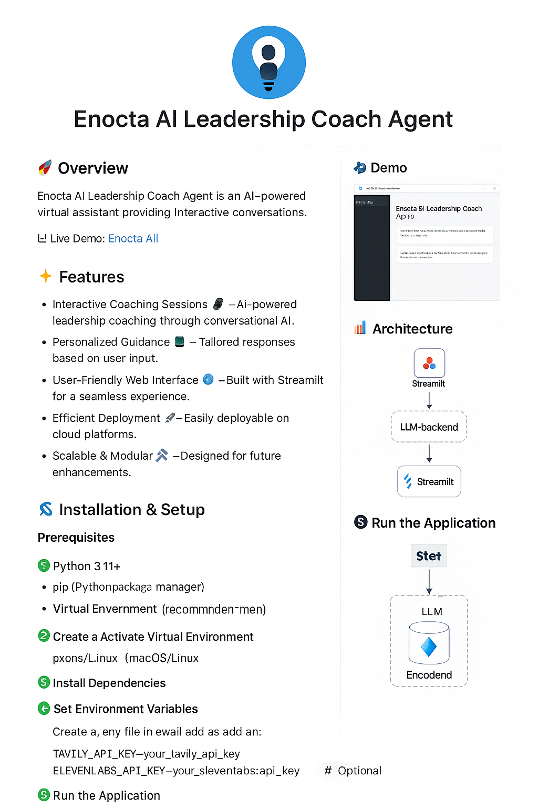

# Enocta AI Leadership Coach Agent




## 🚀 Overview
The **Enocta AI Leadership Coach Agent** is an AI-powered virtual assistant designed to provide leadership coaching through interactive conversations. Built using **Streamlit**, this project offers personalized coaching insights by leveraging large language models (LLMs).

🔗 **Live Demo:** [Enocta AI Leadership Coach Agent](https://enocta-ai-leadership-coach-agent.streamlit.app/)

## ✨ Features
- **Interactive Coaching Sessions** 🗣️ – AI-powered leadership coaching through conversational AI.
- **Personalized Guidance** 📊 – Tailored responses based on user input.
- **User-Friendly Web Interface** 🌐 – Built with Streamlit for a seamless experience.
- **Efficient Deployment** 🚀 – Easily deployable on cloud platforms.
- **Scalable & Modular** 🛠️ – Designed for future enhancements.

## 🏗️ Installation & Setup
Follow these steps to set up and run the project locally.

### Prerequisites
Ensure you have the following installed:
- **Python 3.11+**
- **pip** (Python package manager)
- **Virtual Environment** (recommended)

### 1️⃣ Clone the Repository
```bash
git clone https://github.com/gorkenvm/enocta-ai-leadership-coach-agent.git
cd enocta-ai-leadership-coach-agent
```

### 2️⃣ Create & Activate Virtual Environment
```bash
python -m venv venv
source venv/bin/activate  # macOS/Linux
venv\Scripts\activate    # Windows
```

### 3️⃣ Install Dependencies
```bash
pip install -r requirements.txt
```

### 4️⃣ Set Environment Variables
Create a `.env` file in the root directory and add the following:
```
TAVILY_API_KEY=your_tavily_api_key # Obligation
ELEVENLABS_API_KEY=your_elevenlabs_api_key  # Optional
WEAVIATE_URL=your_weaviate_url  # Optional
```


### 5️⃣ Run the Application
```bash
streamlit run app/streamlit_app.py
```

## 🛠 Deployment
### Deploy on Streamlit Cloud
1. Push your code to a GitHub repository.
2. Go to [Streamlit Cloud](https://share.streamlit.io/).
3. Click **New app** → Connect your GitHub repository.
5. Deploy & enjoy! 🚀

## 📂 Project Structure
```
LEADERSHIP-COACH-AGENT/
├─ app/                               # Application layer (Streamlit, UI entry point)
│  └─ streamlit_app.py
│
├─ assets/                            # Static assets (images, logos, banners)
│  ├─ logo.png
│  └─ banner.png
│
├─ docs/                              # Project documentation
│  └─ EnocTa-AI-Engineer-Project Task Instructions.pdf
│
├─ logs/                              # Log files
│  ├─ leadership_coach.log
│  ├─ qa_extraction.log
│  └─ transcript_processing.log
│
├─ scripts/                           # Helper scripts & pipeline runners
│  ├─ build_index.py
│  ├─ ingest_youtube.py
│  └─ runall.py
│
├─ src/                               # Core source code
│  ├─ agents/
│  │  └─ leadership.py
│  │
│  ├─ leadership_coach/
│  │  ├─ config.py
│  │  └─ agents/
│  │     └─ apiLeadership.py
│  │
│  └─ rag/
│     ├─ data/
│     │  └─ rag_qa_data.json
│     │
│     ├─ index/
│     │  └─ embed.py
│     │
│     ├─ ingest/
│     │  └─ youtube.py
│     │
│     └─ preprocess/
│        └─ clean.py
│     └─ chains.py
│
├─ transcriptions/                    # Raw transcripts
├─ transcriptions_diarized/           # Diarized transcripts (speaker-separated)
│
├─ .env.example                       # Example environment variables
├─ .gitignore
├─ .gitattributes
├─ pyproject.toml
├─ requirements.txt
├─ README.md

```


## 🔧 Future Improvements

- **RAG Raw Data Quality**: Improve the quality and consistency of retrieved data.
- **Advanced Splitters**: Enhance document splitting techniques for better chunking and retrieval.
- **Web Search Whitelist**: Implement a curated whitelist for more reliable external web searches.
- **Hybrid System Design**: Combine different retrieval and generation strategies for optimal performance.
- **Scalability Enhancements**: Optimize for larger datasets and concurrent user requests.
- **Fine-tuning AI Models**: Adapt and fine-tune models based on feedback and specific use cases.
- **User Personalization**: Improve recommendation algorithms for more personalized insights.


## 🤝 Contributing
We welcome contributions! 🚀 If you'd like to improve the project, follow these steps:
1. Fork the repository.
2. Create a new branch (`git checkout -b feature-name`).
3. Commit your changes (`git commit -m "Add new feature"`).
4. Push to your branch (`git push origin feature-name`).
5. Open a pull request.

## 📬 Contact
For any questions or collaboration opportunities, feel free to reach out!
- 📧 Email: gorkenvm@gmail.com
- 🔗 LinkedIn: [Veysel Murat Görken](https://www.linkedin.com/in/veysel-murat-gorken/)

---
🚀 **Happy coding!** 🎉

